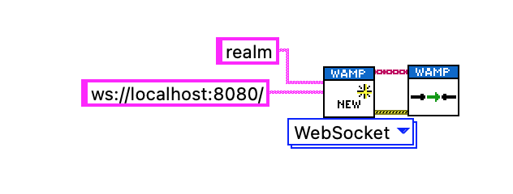
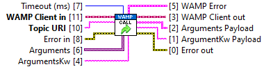
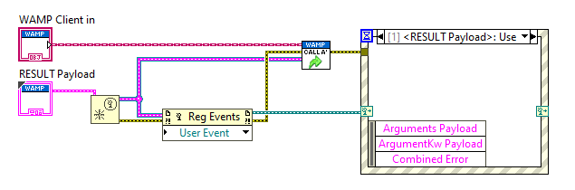

# wamplv

A LabVIEW-based client for the [Web Application Messaging Protocol
(WAMP)](https://wamp-proto.org/). _wamplv_ supports the WAMP basic
profiles for client roles.

*   Platform: Windows, Linux, macOS and Real Time targets
*   Roles: caller, callee, subscriber and publisher
*   Transport: WebSocket, RawSocket TCP
*   Message Serialisation: JSON

This library will only work on LabVIEW 2020 or later. This library is
still in a beta stage and the API is subject to change, but is fully
usable.

The library is designed to give you complete flexibility in how you use
WAMP:

 * All actions within the library can be done either synchronously or
   asynchronously. If an asynchronous VI is used, the result is
   available via a notifier;

 * Once subscribed to a topic, you can choose to received the topic
   events either via LabVIEW user events or via a queue;

 * Once you've registered an endpoint, you can receive the invocations
   by either registering for user event or via a queue.

## Installation

You can install it using the VI package manager.

_wamplv_ is available on the VIPM Community repository. Alternatively,
the VI package is also available to download
[here](https://github.com/samangh/wamplv/releases).

## Instructions

 The VIs in the `Example` folder will show you how to get started.

#### Connecting

Use the `New Client.vi` to create a new WAMP client and then
`Connect.vi` to connect.

The router address must be a fully formed address. Use
`ws://localhost:8080/` to connect to the localhost on port 8080 using
WebSocket. Use `tcp://localhost:8080/` to connect using RawSocket TCP.

When using WebSocket, note that some WAMP routers
(e.g. [Crossbar](https://crossbar.io/)) need a `/ws` sub-URI by default
(i.e. the router address should be `ws://localhost:8080/ws`).

#### Disconnecting

Call `Disconnect.vi` to disconnect.

Notes:

 *  Remember to **always** call `Disconnect.vi` at the end. This will
    disconnect from the router and stop the communication daemon. Simply
    stopping the VI is not enough as the _wamplv_ communication daemon
    runs asynchronously in the background.

 *  If you have finished using the WAMP client after disconnecting
    (i.e. will not reconnect), call `Cleanup.vi` to cleanup any internal
    DVRs and to unregister the user events that _wamplv_creates.

#### Synchronous calls

Synchronous calls can be made using `Call.vi`. This a blocking call and
will block until a reply is received from the router, or a time out
occurs. If the router or callee returns an error, the `Error out`
terminal will be set. Furthermore, the `WAMP error` terminal will
contains details of the WAMP error message received.

#### Asynchronous calls

Asynchronous calls can be made using `Call (async).vi`. This is a
non-blocking VI. You need to create a user event with the `RESULT
payload.ctl` as the user event data, register to it, and then pass it on
to `Call (async.vi)`. The result of the call will be made available via
a user event.

If you don't care about the result of the endpoint call, do not a user
event to this VI.

If there is an error, the WAMP error details and a generated LabVIEW
error based on the WAMP error will be included in the user event data.

#### Publishing

You can publish using `Publish.vi`. The publication is done
asynchronously by default.

If you need confirmation that a publication succeeded, set the `Request
Ack.` terminal to true. In this case the publication will occur
synchronously and the returned `Sucess` terminal will indicated whether
the router successfully published to the topic or not.

If you need to know whether a publication succeeded or not
asynchronously, look at `Publish (async).vi`.

#### Subscribing and receiving notifications

You can subscribe to a topic using `Subscribe.vi`.

Once subscribed, you can receive notifications in the followings ways:

 * By registering for the user event that the `Subscribe.vi` returns;
   this event is triggered everything publication to that specific topic
   is received;

 * By registering for the overall `Event Received` user event (available
   as a property node);

 * By calling `Wait for event.vi`, which will wait until a publication
   event is received or a time out is received; this effectively
   implements a topic publications queue.

#### Registering endpoints and receiving invocations

You can register and endpoint using `Register.vi`.

Once registered, you can receive invocations in the followings ways:

 * By registering for the user event that the `Register.vi` returns;
   this event is triggered everything publication to that specific topic
   is received;

 * By registering for the overall `Endpoint invoked` user event
   (available as a property node);

 * By calling `Wait for Invocation.vi`, which will wait until an
   endpoint is invoked or it times out; this effectively implements a
   endpoint invocations queue.

## License

Licensed under LGPG v2.1 with exceptions. See [LICENSE](LICENSE).
