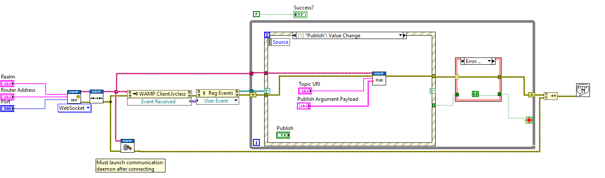

# lvwamp

A LabVIEW-based client for the [Web Application Messaging Protocol
(WAMP)](https://wamp-proto.org/).

The aim is for _lvwamp_ to provide the WAMP basic profiles for client roles.

*   Platform: Windows, Linux, macOS and Real Time targets
*   Roles: subscriber and publisher
*   Transport: WebSocket
*   Message Serialisation: JSON

Dependencies:

*   LabVIEW 2020 or later
*   [MediaMongrels' WebSockets toolkit](https://www.vipm.io/package/mediamongrels_ltd_lib_websockets_api/)
*   [JDP Science's JSONtext toolkit](https://www.vipm.io/package/jdp_science_jsontext/)

## Instructions

Clone this repository (preferably underneath the `usr.lib` folder in
your LabVIEW installation) and open the project. The VIs in the
`Example` folder will show you how to get started.

## License

Licensed under LGPG v2.1 with exceptions. See [LICENSE](LICENSE).
