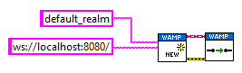
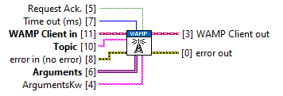

# _wamplv_ User Guide

<!-- markdown-toc start - Don't edit this section. Run M-x markdown-toc-refresh-toc -->
**Table of Contents**

- [_wamplv_ User Guide](#_wamplv_-user-guide)
    - [Connecting](#connecting)
    - [Disconnecting](#disconnecting)
    - [Synchronous calls](#synchronous-calls)
    - [Asynchronous calls](#asynchronous-calls)
    - [Publishing](#publishing)
    - [Subscribing and receiving notifications](#subscribing-and-receiving-notifications)
    - [Registering endpoints and receiving invocations](#registering-endpoints-and-receiving-invocations)

<!-- markdown-toc end -->

## Connecting

Use the `New Client.vi` to create a new WAMP client and then
`Connect.vi` to connect.

The router address must be a fully formed URI, including the port. Some
examples:

  *  `tcp://localhost:8080/`
  *  `tcps://loclhost:8080/`
  *  `ws://localhost:80/`
  *  `ws://localhost:80/ws`
  *  `wss://localhost:80/`

## Disconnecting

Call `Disconnect.vi` to disconnect.

Notes:

 *  Remember to **always** call `Disconnect.vi` at the end. This will
    disconnect from the router and stop the communication daemon. Simply
    stopping the VI is not enough as the _wamplv_ communication daemon
    runs asynchronously in the background.

 *  If you have finished using the WAMP client after disconnecting
    (i.e. will not reconnect), call `Cleanup.vi` to cleanup any internal
    DVRs and unregister the user events that _wamplv_creates.

## Synchronous calls

Synchronous calls can be made using `Call.vi`. This a blocking call and
will block until a reply is received from the router, or a time out
occurs. If the router or callee returns an error, the `Error out`
terminal will be set. Furthermore, the `WAMP error` terminal will
contains details of the WAMP error message received.

## Asynchronous calls

Asynchronous calls can be made using `Call (async).vi`. This is a
non-blocking VI. You need to create a user event with the `RESULT
payload.ctl` as the user event data, register to it, and then pass it on
to `Call (async.vi)`. The result of the call will be made available via
a user event.

If you don't care about the result of the endpoint call, do not a user
event to this VI.

If there is an error, the WAMP error details and a generated LabVIEW
error based on the WAMP error will be included in the user event data.

## Publishing

You can publish using `Publish.vi`. The publication is done
asynchronously by default.

If you need confirmation that a publication succeeded, set the `Request
Ack.` terminal to true. In this case the publication will occur
synchronously and the returned `Sucess` terminal will indicated whether
the router successfully published to the topic or not.

If you need to know whether a publication succeeded or not
asynchronously, look at `Publish (async).vi`.

## Subscribing and receiving notifications

You can subscribe to a topic using `Subscribe.vi`.

Once subscribed, you can receive notifications in the followings ways:

 * By registering for the user event that the `Subscribe.vi` returns;
   this event is triggered everything publication to that specific topic
   is received;

 * By registering for the overall `Event Received` user event (available
   as a property node);

 * By calling `Wait for event.vi`, which will wait until a publication
   event is received or a time out is received; this effectively
   implements a topic publications queue.

## Registering endpoints and receiving invocations

You can register and endpoint using `Register.vi`.

Once registered, you can receive invocations in the followings ways:

 * By registering for the user event that the `Register.vi` returns;
   this event is triggered everything publication to that specific topic
   is received;

 * By registering for the overall `Endpoint invoked` user event
   (available as a property node);

 * By calling `Wait for Invocation.vi`, which will wait until an
   endpoint is invoked or it times out; this effectively implements a
   endpoint invocations queue.
